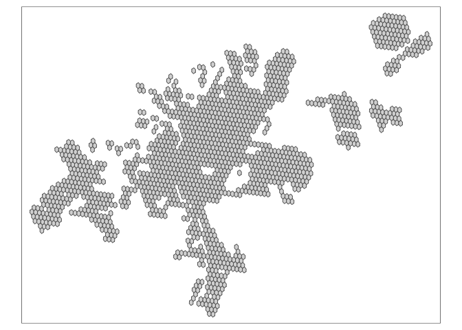

To conduct an accessibility analysis, we need:  
1) OSM Road Data  
2) Shapefile of the study area (with population and employment
distribution)  
3) GTFS feed

We use these inputs to make queries on Open Trip Planner

The shapefile and GTFS feed have been made available by Transport for
Cairo, an Egyptian public transport consultancy

### Part 1: OSM Data

Define the geographic extents as a vector of c(xmin, ymin, xmax, ymax)

You can plot to see if the roads have been downloaded. This takes around
10 minutes and the sp file is huge. I will not do it here, but for
checking purposes, this is how it would be done:

1.  convert xml to sp using osmdata\_sp(query)

2.  plot sp::plot(highways\_greaterCairo$osm\_lines)
    highways\_greaterCairo &lt;- osmdata\_sp(query)

An alternative to xml is pbf files. These are more compact and
presumably make the forthcoming analysis faster. They can be downloaded
from the HOT OSM export tool
<a href="https://export.hotosm.org/en/v3/exports/new/formats?fbclid=IwAR3m_1bDZK2sYsA-jtPRPYGg9R7kTqt5hzjP88x3p2yvRd4i9tr11i2tG60" class="uri">https://export.hotosm.org/en/v3/exports/new/formats?fbclid=IwAR3m_1bDZK2sYsA-jtPRPYGg9R7kTqt5hzjP88x3p2yvRd4i9tr11i2tG60</a>

I tried to use a pbf file but the analysis was not quicker so I stuck to
the xml file extracted from r

### Part 2: Importing Shapefiles for Analysis

In this step I import a shapefile of Greater Cairo. The shapefile has
the region divided into hexagons with the population and number of jobs
in each hexagon

    library(sf)

    ## Warning: package 'sf' was built under R version 3.6.2

    ## Linking to GEOS 3.7.2, GDAL 2.4.2, PROJ 5.2.0

    # import the shapefile
    cairo_hexagons <- st_read("Cairo Shapefiles/H3-res8/H3res-8_GCR_4326.shp")

    ## Reading layer `H3res-8_GCR_4326' from data source `/Users/Hussein/Documents/Code Repos/GIS-Coursework/Cairo Shapefiles/H3-res8/H3res-8_GCR_4326.shp' using driver `ESRI Shapefile'
    ## Simple feature collection with 1613 features and 22 fields
    ## geometry type:  POLYGON
    ## dimension:      XY
    ## bbox:           xmin: 30.8684 ymin: 29.71863 xmax: 31.83956 ymax: 30.35436
    ## CRS:            4326

It is imported and in the corrected crs EPSG:4326

Let’s plot to check if it looks right

    library(tmap)

    # plot
    tm_shape(cairo_hexagons) +
                  tm_polygons()

